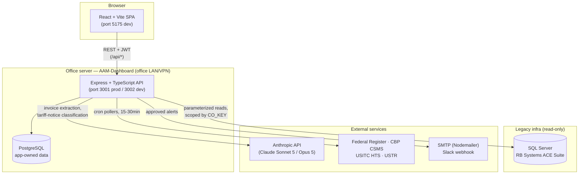
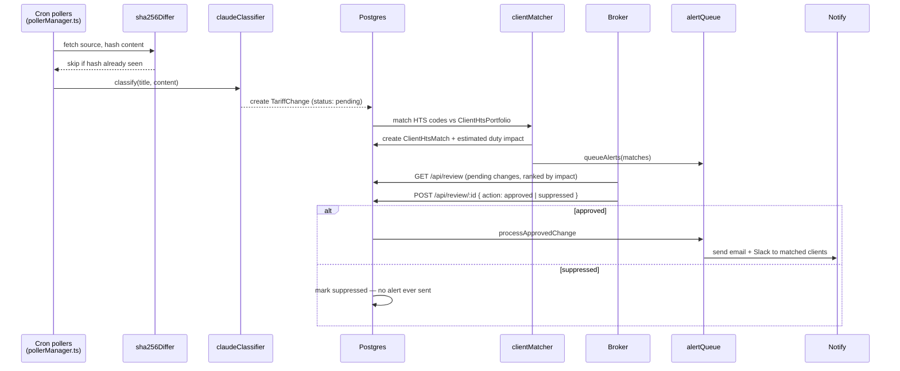
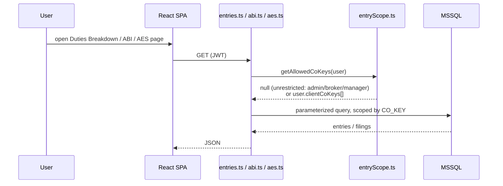
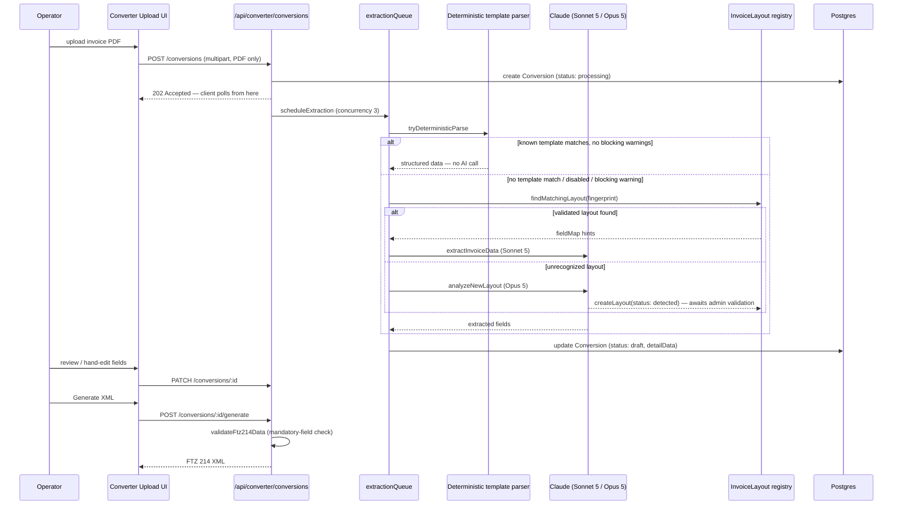

# Duties Dashboard

Operational dashboard for **JD Group** (Agencia Aduanal Jorge Díaz, S.C.) — a customs
brokerage / freight-forwarding operation on the Tijuana–San Diego border corridor.
It gives brokers, coordinators, and managers one place to review customs entries and
filings, monitor U.S. tariff/duty changes against client HTS portfolios, and convert
export invoices into FTZ 214 zone-admission XML filings.

> **Note on naming:** this directory is `duties-dashboard`, but the GitHub repository
> is `jcanales/aaa-dashboard` — a legacy name from before the app's scope grew beyond
> the original AAA-Converter tool.

---

## What it does

The app is really three products sharing one login, one Postgres database, and one
Express API:

| Module | Purpose | Key pages |
|---|---|---|
| **Entries / ABI / AES / IEEPA** | Read-only views over the legacy RB Systems ACE Suite data (SQL Server) — customs entries, HTS duty breakdowns, ABI statements/crossings, AES export filings, IEEPA-specific analysis. | `DashboardPage`, `DutiesBreakdownPage`, `AbiStatementsPage`, `AbiCrossingsPage`, `AesPage`, `IeepaPage` |
| **Tariff Change Monitoring** | Polls U.S. federal sources for tariff/duty changes, classifies them with Claude, matches them against each client's HTS portfolio, and routes them through a mandatory broker review gate before emailing/Slacking alerts. | `TariffPage` (admin-only) |
| **FTZ Converter** | Turns bilingual Mexican export invoices (PDF) into FTZ 214 admission XML for CBP filing — via a deterministic template parser first, Claude extraction as fallback, with self-learning invoice-layout detection. | `converter/UploadPage`, `ReviewPage`, `OperationReviewPage`, `HistoryPage`, `ConfigurationPage` |

Everything is gated by JWT auth + role-based access control (`staff`, `coordinator`,
`manager`, `admin`, `broker`); see [Access control](#access-control) below.

---

## Tech stack

| Layer | Technology |
|---|---|
| Frontend | React 18 + TypeScript, Vite, React Router 7, Zustand, Tailwind + Radix UI, Recharts, react-dropzone, pdfjs-dist, jsPDF/@react-pdf/renderer |
| Backend | Node.js + Express + TypeScript |
| App database | PostgreSQL via Prisma |
| Legacy database | SQL Server (RB Systems ACE Suite), read-only, raw `mssql` driver |
| AI | Anthropic API (`@anthropic-ai/sdk`) — Claude Sonnet 5 / Opus 5 |
| Scheduling | `node-cron` (tariff pollers) |
| Notifications | Nodemailer (SMTP) + Slack webhook |
| Auth | JWT (`jsonwebtoken` + `bcryptjs`) |
| Process management | pm2 (production), Docker Compose (Postgres only) |
| CI/CD | GitHub Actions on a self-hosted runner |

---

## Architecture



The backend is a single Express app (`backend/src/api/server.ts`) mounting all
routes; there's no separate microservice per module. Route middleware order:
CORS → security headers → global rate limiter → `/health` (no auth) → `/api/auth`
(no auth) → JWT auth for everything else → the module routers.

Production and dev run **on the same physical office server**, isolated by
port/path/pm2-process/Postgres-container — see
[`CLAUDE.md`](./CLAUDE.md#production--dev-deployment) for the full deploy topology,
including the self-hosted GitHub Actions runner and Prisma migration history notes.

---

## Data flows

### 1. Tariff change monitoring



Four pollers run on independent cron schedules — Federal Register (15 min), CBP
CSMS (20 min), USITC HTS (30 min), USTR (30 min). The broker/admin review step in
`review.ts` is a **non-bypassable gate**: nothing reaches a client until a human
approves it.

### 2. Entries / ABI / AES (legacy MSSQL reads)



`abi.ts`/`aes.ts` import their role-scoping helpers from `entryScope.ts` rather than
keeping their own copies — see [`CLAUDE.md`](./CLAUDE.md#access-control-rbac) for
where that duplication still legitimately exists.

### 3. FTZ Converter (invoice → FTZ 214 XML)



Multiple invoice `Conversion`s can be grouped into one `Operation` (a combined
admission with merged lines and a single `FtzAllocation` number) via the Operations
flow — `converterOperations.ts` / `OperationReviewPage`.

---

## Project structure

```
duties-dashboard/
├── src/                          # Frontend (React + Vite)
│   ├── api/                      # Typed fetch wrappers: abiApi, aesApi, entriesApi, tariffApi, converterApi, agentsApi
│   ├── components/
│   │   ├── ui/                   # Design-system primitives
│   │   ├── layout/                # AppShell, nav
│   │   └── converter/             # FTZ Converter-specific components
│   ├── hooks/converter/
│   ├── lib/converter/
│   ├── pages/                    # One file per route (see App.tsx)
│   │   └── converter/             # UploadPage, ReviewPage, OperationReviewPage, HistoryPage, ConfigurationPage
│   ├── store/                    # Zustand: authStore, clientStore, dateStore, filterStore
│   ├── types/converter/
│   └── App.tsx                   # Route table + RequireAuth/RequireFullAccess/RequireAdminOnly guards
│
├── backend/
│   ├── src/
│   │   ├── api/
│   │   │   ├── server.ts         # Express app: middleware chain + route mounting
│   │   │   ├── middleware/       # authenticateJWT, requireRole, rateLimiter
│   │   │   └── routes/           # auth, changes, clients, review, alerts, entries, abi, aes,
│   │   │                         #   htsBreakdown, converter* (8 route files)
│   │   ├── pollers/               # federalRegisterPoller, cbpCsmsPoller, usitcHtsPoller, ustrPoller, pollerManager
│   │   ├── diffing/                # sha256Differ, changeDetector
│   │   ├── matching/               # clientMatcher, impactCalculator
│   │   ├── ai/                    # claudeClassifier (tariff notices)
│   │   ├── alerts/                 # alertQueue, emailSender, slackSender
│   │   ├── agents/                 # skillRegistry (AgentsPage backend)
│   │   ├── converter/
│   │   │   ├── services/          # conversionsService, extractionService, extractionQueue, facilityService, …
│   │   │   ├── parsing/            # deterministic invoice template parsers (e.g. claveA1.ts) + PDF text/cell extraction
│   │   │   ├── layouts/            # InvoiceLayout fingerprinting + registry (self-learning layouts)
│   │   │   ├── ftz214/             # field definitions, schema builder, XML builder, validation
│   │   │   ├── middleware/         # accessLog, rateLimit
│   │   │   └── config/
│   │   ├── db.ts                  # Prisma client (Postgres)
│   │   └── db/mssql.ts             # Legacy SQL Server connection pool
│   ├── prisma/
│   │   ├── schema.prisma
│   │   └── migrations/            # Single consolidated baseline — see CLAUDE.md
│   ├── ecosystem.config.cjs        # pm2 process definition (shared by prod/dev via env vars)
│   └── docker-compose.yml          # Postgres only
│
├── .github/workflows/
│   ├── deploy-dev.yml              # push to `dev` → dev-usbroker.jdgroup.net
│   └── deploy-prod.yml             # push to `master` → usbroker.jdgroup.net
│
├── scripts/                        # setup-server.sh, install-github-runner.sh, create-admin.js, wipe-conversions.js
├── docs/
└── CLAUDE.md                       # Deploy topology, migration history, RBAC, dependency debt
```

---

## Access control

Roles: `staff`, `coordinator`, `manager`, `admin`, `broker`.

- Legacy-entry scoping (`entryScope.ts`): `admin`, `broker`, and `manager` are
  unrestricted; everyone else is scoped to their own `User.clientCoKeys`.
- Tariff review/alerts (`review.ts`, `alerts.ts`): `broker`/`admin` only.
- Tariff-monitoring clients, alerts config, and review pages: `admin`/`broker` only
  (deliberately not opened to `manager`).
- FTZ Converter user management re-checks the caller's **live** DB role (not the
  JWT) before granting admin-level actions, since a JWT can be up to 8h stale.

Full detail, including where role checks are intentionally duplicated across route
files and why, lives in [`CLAUDE.md`](./CLAUDE.md#access-control-rbac).

---

## Local development

```bash
# Frontend (port 5175)
npm install
npm run dev

# Backend (port 3001) — separate terminal
cd backend
npm install
docker compose up -d        # Postgres
npx prisma migrate dev
npm run dev
```

Required backend env vars (`backend/.env`, see `backend/.env.example`):
`JWT_SECRET`, `DATABASE_URL`/`PG_*`, `MSSQL_HOST`/`MSSQL_PORT`/`MSSQL_DATABASE`/
`MSSQL_USER`/`MSSQL_PASSWORD`, `ANTHROPIC_API_KEY`. The legacy MSSQL connection is
read-only against RB Systems — see `mssql-mcp/` in the wider client repo for the
equivalent exposed as Claude tools.

---

## Deployment

Production and dev share one physical office server behind a self-hosted GitHub
Actions runner (the box has no inbound SSH reachable from GitHub-hosted runners).

| | Production | Dev |
|---|---|---|
| URL | usbroker.jdgroup.net | dev-usbroker.jdgroup.net |
| Trigger | push to `master` | push to `dev` |
| Backend port | 3001 | 3002 |
| Postgres port | 5433 | 5434 |
| pm2 process | `duties-backend` | `duties-backend-dev` |

See [`CLAUDE.md`](./CLAUDE.md) for the full topology, required GitHub secrets,
Prisma migration-baseline history, and known `npm audit` dependency debt.
